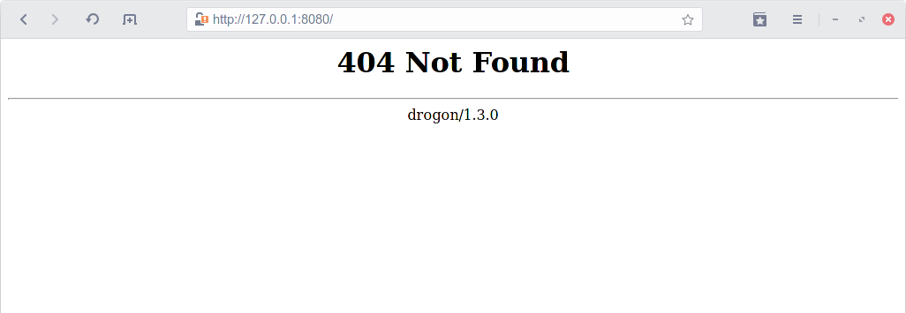

# Hello World

## A blank slate

Let's start with the simplest application possible - An app that does absolutely nothing. We first include Drogon's header file. Then call **addListener\(\)** to tell Drogon to start \(listen\) the server on 127.0.0.1 and port 8080. Finally **run\(\)** kicks everything into action.


```cpp
#include <drogon/drogon.h>
using namespace drogon;

int main()
{
    app().addListener("127.0.0.1", 8080)
         .run();
}
```


Drogon integrates itself with [CMake](https://cmake.org/). So we'll be using CMake throughout the tutorials. Don't worry if CMake looks daunting at first. It's infact simple. You declare a project, check if dependencies are avaliable on the computer, tell CMake which are the source files then apply the dependencies. CMake will handle the job of actually compiling and tracking changes for you.


```bash
cmake_minimum_required(VERSION 3.5)
project(example1)

add_executable(example1)
find_package(Drogon REQUIRED)
target_sources(example1 PRIVATE example1.cpp)
target_link_libraries(example1 PRIVATE ${DROGON_LIBRARIES})
target_include_directories(example1 PUBLIC ${DROGON_INCLUDE_DIRS})
```


Save the two files, then run the commands:

```bash
mkdir build
cd build
cmake ..
make -j
```


This tutorial \(and all following ones\) assumes you are in a UNIX environment. Windows users can open the CMake project in Visual Studio by selecting **File &gt; Open &gt; Folder** then navigate to the folder containing CMakeLists.txt.

See [here](https://docs.microsoft.com/zh-tw/cpp/build/cmake-projects-in-visual-studio?view=msvc-160) for reference.



You only have to run `mkdir` and `cmake`once. You can `cd`into the directory then execute `make` after the first time.


You should see an executable file `example1` after a successful build. Running it launches application.

```text
❯ ./example1
```

Now open your browser, and type `http://127.0.0.1:8080` in the URL. Don't be shocked when a 404 page shows up. It's exactly what should happen. That means the app is running and we haven't added any resource or handlers yet.



This is a good stop to start figuring out what is wrong if anything goes south. Common pitfalls includes having a system provided build and a self made build installed together. Or having a dependency being out of date. Please remove the extra version or perform a system update and try again.

## Hello World

Now we can start working. The simplest way in Drogon to add an handler is through the `registerHandler()` method and passing it the path and the handler. Then the handler will be executed upon an user accessing said path. So having "/hello" as the path means it will be executed when users visit the "/hello" page.

```cpp
app().registerHandler("/hello", [](const HttpRequestPtr& req,
                       std::function<void (const HttpResponsePtr &)> &&callback)
{
    auto resp = HttpResponse::newHttpResponse();
    resp->setBody("Hello World");
    callback(resp);
});
```


All paths starts with a '/' \(forward slash\). Akin to absolute paths in an UNIX system. "/" \(a single forward slash\) is the default page for most browsers.


Recompile, run and enter `http://127.0.0.1:8080/hello` into the URL bar. Now you should see "Hello World" in the page.


